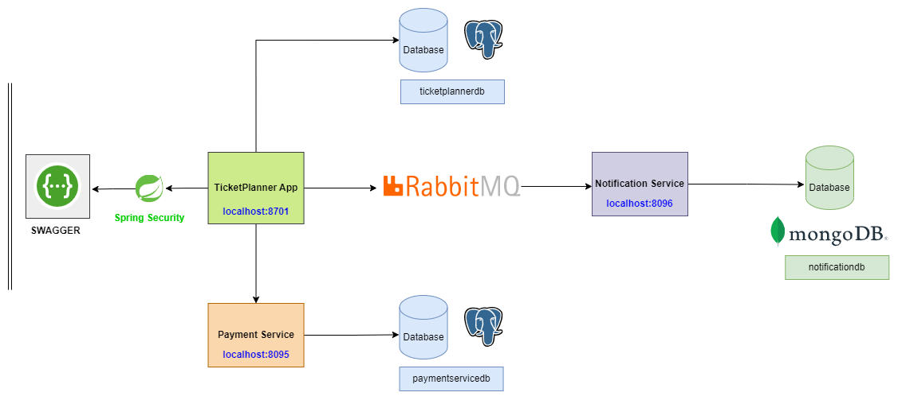
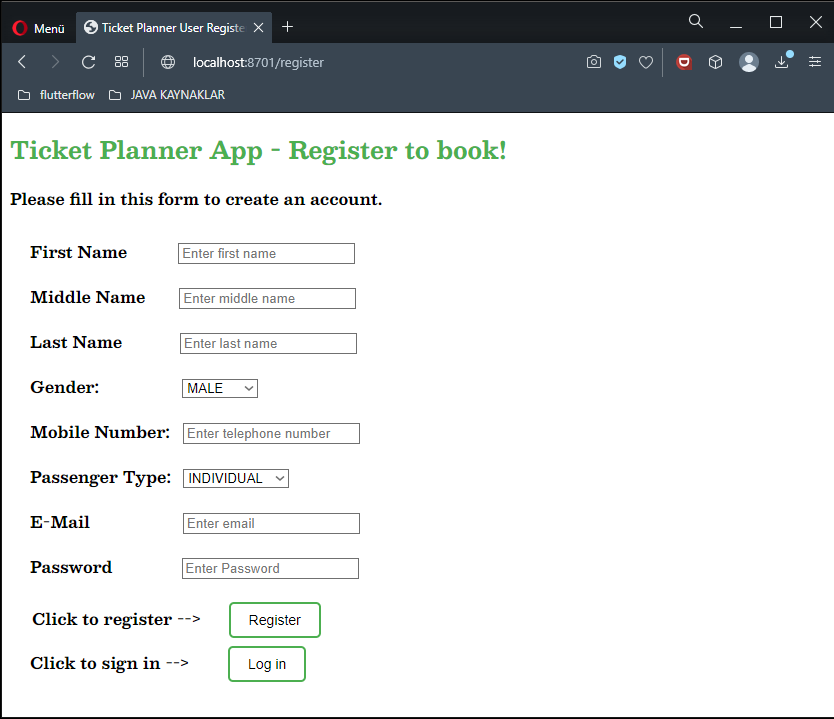

<!-- ABOUT THE PROJECT -->

## Kodluyoruz X Solmaz Final Project

### Process Chart of All Services 

### About Project

The subject of this project is to build the system for online bus and ticket sales with java and spring boot.

### System Requirements

- Users must be able to register and login to the system.
- After the user registration, an e-mail should be sent.
- The user password must be saved in the database with a hashing algorithm of your choice.
- The admin user can add new flights, cancel them, see the total ticket sales and the total price obtained from this sale.
- Users should be able to search for all flights with city, vehicle type (plane & bus) or date information.
- An individual user can purchase a maximum of 5 tickets for the same trip.
- Individual users can purchase tickets for a maximum of 2 male passengers in a single order.
- A corporate user can purchase a maximum of 20 tickets for the same trip.
- If the purchase is successful, the transaction should be completed and the ticket details should be sent asynchronously via sms to the user's phone number.
- Only database registration is sufficient for sending SMS, mail and push notifications. But these operations should be done through a single Service (application) and with polymorphic behavior.
- Users should be able to see the tickets they bought.

### System Acceptances
- Users can be individual or corporate.
- SMS, Mail and Push Notification sending processes must be Asynchronous.
- Aircraft passenger capacity: 189
- Bus passenger capacity: 45
- Payment method can only be Credit card and Money Order / EFT.
- Payment Service transactions must be Synchronous.

### ER Diagram of Services

<!-- TECHNOLOGIES -->

### Technologies Used

<!-- OUTPUT SCREENSHOTS -->

### Login & Register Page of Application

### Swagger Page of Application

<!-- LICENSE -->
## License

Distributed under the MIT License. See `LICENSE.txt` for more information.

<!-- CONTACT -->

## Contact

### Mehmet Akif Tanisik

  

<!-- PROJECT-BOOTCAMP-PRACTICUM PART -->

 

## Java & Spring Boot | Bootcamp - Kodluyoruz & Solmaz

  

<h3 align="center">Company: Solmaz Customs Consultancy/Brokerage Co.</h3>

  
<h3 align="center">Organizer: Kodluyoruz.org</h3>

